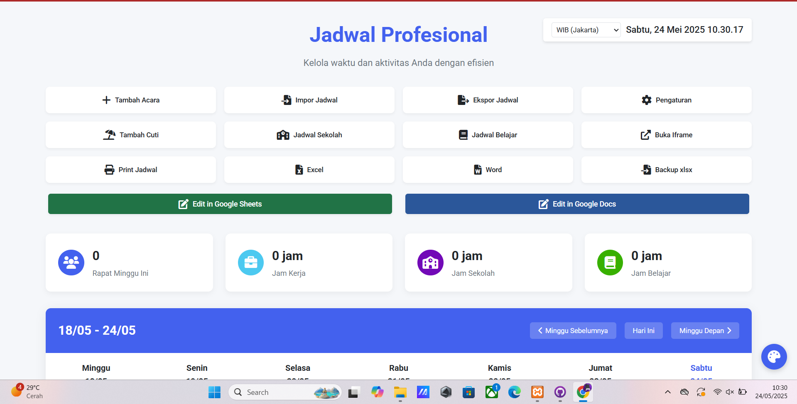
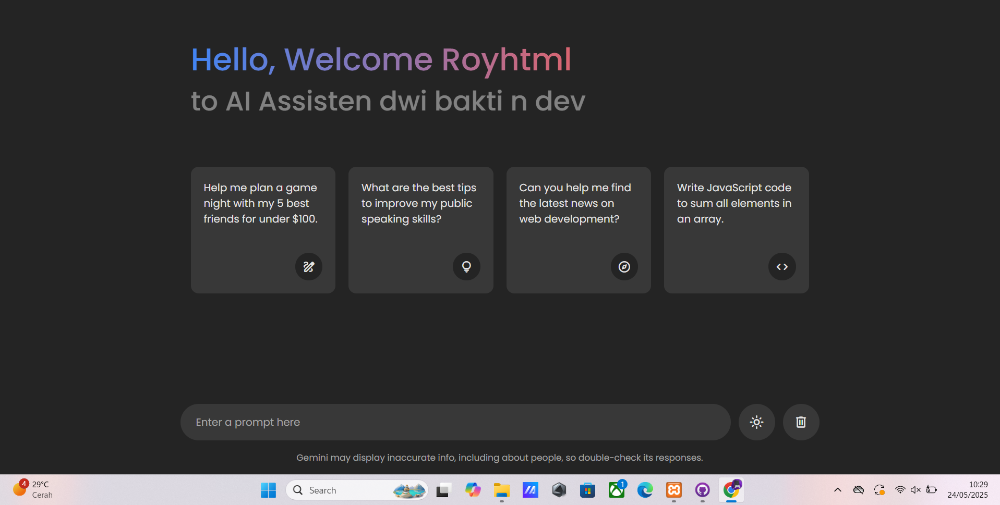
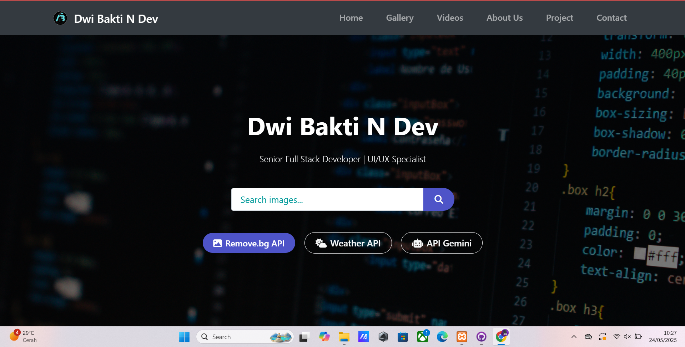

---

# 🌐📦 Web to APK Builder

**Web to APK Builder** adalah alat untuk mengonversi situs web menjadi aplikasi Android (APK) dengan antarmuka pengguna (UI) profesional. Cocok untuk pengembang, pemilik bisnis, atau siapa pun yang ingin membuat aplikasi Android dari website mereka dengan cepat tanpa harus menguasai pemrograman Android.

---

## ✨ Fitur Utama

* ✅ Konversi situs web ke APK dalam hitungan menit
* ✅ UI/UX profesional dan responsif
* ✅ Dukungan untuk splash screen dan ikon kustom
* ✅ Push Notification (OneSignal)
* ✅ Dukungan pemuatan offline / caching
* ✅ Bisa menjalankan aplikasi berbasis PWA (Progressive Web App)
* ✅ Dukungan SSL/HTTPS
* ✅ Mode landscape/portrait
* ✅ Integrasi AdMob (iklan dalam aplikasi)

---

## 📹 Video Tutorial UI Profesional

📺 **Tonton tutorial lengkap:**

<a href = "https://www.tiktok.com/@royhtml/video/7507841528899849478?is_from_webapp=1&sender_device=pc&web_id=7489705398321759751"></a>

> ⚠️ Ganti `VIDEO_ID` dengan ID video asli YouTube Anda.

---

## 🚀 Cara Menggunakan

1. Clone atau download proyek ini:

   ```bash
   git clone https://github.com/royhtml/web-to-apk-builder.git
   cd web-to-apk-builder
   ```

2. Buka proyek dengan Android Studio.

3. Ubah URL situs web Anda di file:

   ```java
   webView.loadUrl("https://yourwebsite.com");
   ```

4. Tambahkan ikon dan splash screen pada folder `res/drawable`.

5. Build APK dengan Android Studio.

6. APK siap untuk diinstal di perangkat Android Anda.

---

## 📦 Builder yang Cracked vs Tidak Cracked

| Nama Builder             | Status          | Keterangan                                  |
| ------------------------ | --------------- | ------------------------------------------- |
| Web2Apk (by AppsGeyser)  | ❌ Tidak Cracked | Harus login, branding tetap muncul          |
| WebViewGold (Codecanyon) | ✅ Cracked       | Versi cracked tersedia di forum tertentu    |
| GoNative.io              | ❌ Tidak Cracked | Harus bayar \$790 untuk build APK           |
| WebToApp (by DaviDevs)   | ✅ Cracked       | Versi cracked beredar di GitHub tidak resmi |
| PWA2APK                  | ✅ Cracked       | Sumber terbuka dan bebas digunakan          |
| Thunkable / Kodular      | ❌ Tidak Cracked | Branding tetap muncul kecuali akun premium  |

> ⚠️ **Disclaimer:** Menggunakan versi cracked adalah ilegal dan melanggar hak cipta. Gunakan hanya untuk pembelajaran atau riset pribadi. Jika Anda menggunakan builder secara komersial, **dianjurkan membeli lisensi resmi**.

---

## 📱 Contoh Aplikasi yang Dibuat ole seorang cracker

| Nama Aplikasi  | URL Asli                                         | Tangkapan Layar                          |
| -------------- | ------------------------------------------------ | ---------------------------------------- |
| Jadwal Profesional  | [Cclick](https://jadwal-profesional.vercel.app/) |     |
| Bruno Ai    | [click](https://dwibakti.netlify.app/) |       |
| Portfolio  | [click](https://profiledwibaktindev.netlify.app/)               |  |

---

## 📄 Lisensi

Proyek ini menggunakan lisensi [MIT License](LICENSE). Anda bebas menggunakannya untuk keperluan pribadi dan komersial.

---
